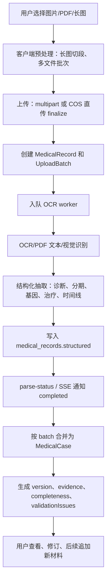

# Treatbot 结构化病历信息文档

更新时间：2026-05-26

## 1. 文档目标

本文用于审阅 Treatbot 从 OCR 上传到结构化病历保存、读档、修订、复用的产品与数据口径。目标不是替代临床判断，而是形成一份稳定、可解释、可持续更新的患者病例档案，供患者复查、补全信息、匹配临床试验时复用。

当前建议把结构化病历分成两层：

- `MedicalRecord`：单份上传材料的 OCR 结果，记录文件、识别状态、结构化抽取结果。
- `MedicalCase`：用户级病例档案，由一份或多份 `MedicalRecord` 合并生成，支持版本、修订、证据追溯。

## 2. 核心对象

### 2.1 MedicalRecord：单份材料结果

单份上传文件对应一个 `medical_records` 记录。

关键字段：

| 字段 | 含义 | 说明 |
| --- | --- | --- |
| `id` | recordId/fileId | 客户端轮询、streaming、读档使用的主标识 |
| `user_id` | 用户归属 | 所有查询、streaming、下载必须校验本人 |
| `batch_id` | 上传批次 | 一次上传多份材料时关联同一个 batch |
| `case_id` | 病例档案 | OCR 完成并合并后关联到 case |
| `file_key` | COS 对象路径 | 原始文件不走 API 大流量传输 |
| `file_hash` | 文件 hash | 用于重复上传复用、OCR cache |
| `status` | `pending/running/completed/error` | DB 主状态 |
| `status_phase` | 细分阶段 | `queued/analyzing/streaming/structuring` 等 |
| `diagnosis/stage/gene_mutation/treatment/treatment_line/pdl1` | 兼容字段 | 旧接口和列表页快速展示 |
| `structured` | 完整结构化 payload | 新接口和 case 合并的主要来源 |
| `deleted_at` | 软删除 | 用户删除后查询和 stream 均应排除 |

`structured` 推荐格式：

```json
{
  "schemaVersion": 1,
  "promptVersion": "ocr-v1",
  "entities": {},
  "confidence": 0.86,
  "source": "ocr",
  "providerMeta": {
    "provider": "doubao",
    "fallbacks": [],
    "pageCount": 3,
    "textLength": 4280
  },
  "text": "<PII scrubbed raw text or limited preview>",
  "updatedAt": "2026-05-26T00:00:00.000Z"
}
```

### 2.2 UploadBatch：一次上传任务

一次上传一张、多张、长图切段或 PDF 多文件后，都应形成一个 `upload_batches` 记录。

关键字段：

| 字段 | 含义 |
| --- | --- |
| `id` | batchId |
| `record_ids` | 本批次内成功创建 record 的 id 列表，可包含同批重复文件映射 |
| `total_count` | 用户本次选择/切段后的总份数 |
| `processed_count` | 已进入终态的份数 |
| `success_count` | 完成 OCR 的份数 |
| `failed_count` | 上传失败、finalize 失败、OCR 失败、not_found 的总数 |
| `status` | `pending/running/completed/error` |
| `metadata.uploadFailedCount` | 客户端直传失败但未创建 record 的数量 |

产品展示示例：

```text
已处理 4 / 5 份（成功 4）
已花 61 秒，这份内容偏多，再稍等一下
```

### 2.3 MedicalCase：用户病例档案

`medical_cases` 是用户可反复查看和持续更新的“当前病例档案”。

关键字段：

| 字段 | 含义 |
| --- | --- |
| `id` | caseId |
| `user_id` | 用户归属 |
| `active_version_id` | 当前版本 |
| `status` | 默认 `active` |
| `entities` | 当前合并后的结构化病历 |
| `summary` | 诊断、分期、基因、治疗线数等摘要 |
| `source_record_ids` | 参与当前 case 的 record 列表 |
| `completeness` | 字段完整度 |
| `validation_issues` | 结构化校验问题 |
| `normalized_tags` | 癌种、治疗类型、分子标志物等标准化标签 |

### 2.4 CaseVersion / Revision / Evidence

| 对象 | 用途 |
| --- | --- |
| `medical_case_versions` | 每次 OCR 合并生成一个版本，便于回溯 |
| `medical_case_revisions` | 用户手动修订字段，用户修订优先于 OCR |
| `medical_field_evidence` | 字段证据来源，记录 recordId、字段值、置信度、snippet |

## 3. 结构化字段口径

### 3.1 展示分组

最终面向用户建议分成 7 个组：

| 组 | 用途 | 代表字段 |
| --- | --- | --- |
| 诊断 | 判断疾病方向和匹配主入口 | `diagnosis`, `pathologyType` |
| 分期 | 判断疾病阶段和转移情况 | `stage`, `tnmStage`, `metastasisSites` |
| 基因/分子 | 匹配靶向、免疫、分子入组条件 | `geneMutation`, `molecular`, `pdl1` |
| 既往治疗 | 判断治疗线数、既往用药、耐药和排除条件 | `treatment`, `treatmentLine`, `priorTherapies`, `treatmentHistory` |
| 基本信息 | 入排年龄、体能状态、医院、城市 | `age`, `sex/gender`, `ecog`, `hospital`, `city` |
| 检查指标 | 实验室、影像、肿瘤标志物 | `labValues`, `bloodCounts`, `tumorMarkers`, `imaging` |
| 风险禁忌 | 感染、免疫、自身免疫、妊娠、移植 | `hbvStatus`, `hcvStatus`, `hivStatus`, `autoimmuneDisease`, `pregnancyStatus`, `organTransplant` |

### 3.2 建议字段清单

#### 基本入组信息

| 字段 | 中文名 | 类型 | 必填建议 | 备注 |
| --- | --- | --- | --- | --- |
| `diagnosis` | 临床诊断 | string | 是 | 如直肠癌、肺腺癌 |
| `pathologyType` | 病理/组织学类型 | string | 是 | 如腺癌、鳞癌 |
| `age` | 年龄 | number | 是 | 0-120 |
| `sex` / `gender` | 性别 | enum | 否 | 建议统一为 `sex`，客户端兼容 `gender` |
| `stage` | 分期 | enum/string | 是 | I/II/III/IV、局部晚期、转移性 |
| `tnmStage` | TNM 分期 | string | 否 | 原文保留 |
| `ecog` | ECOG 评分 | number/string | 是 | 0-4 |
| `hospital` | 医院 | string | 否 | 用于证据和地理上下文 |
| `city` | 就诊城市 | string | 否 | 匹配临床试验地点 |
| `diagnosisDate` | 诊断日期 | string | 否 | 建议 ISO 或原文日期 |
| `consentSigned` | 知情同意 | enum | 是 | 用于产品流程，不建议完全依赖 OCR |
| `targetLesion` | 可测量病灶 | enum | 是 | RECIST 相关 |

#### 肿瘤和分子信息

| 字段 | 中文名 | 类型 | 备注 |
| --- | --- | --- | --- |
| `geneMutation` | 基因/免疫组化摘要 | string | 兼容老字段，用于快速展示 |
| `pdl1` / `pdL1` | PD-L1 表达 | string | 建议统一后端为 `pdl1`，客户端兼容 `pdL1` |
| `molecular.drivers` | 驱动基因 | array | EGFR、ALK、ROS1、KRAS 等 |
| `molecular.actionable` | 可行动突变 | array | 可用于靶向匹配 |
| `molecular.lossOfFunction` | 功能缺失 | array | 如 TP53 等 |
| `molecular.vus` | 临床意义未明变异 | array | 保留原文 |
| `molecular.biomarkers` | 分子标志物 | object | MSI/MMR/HER2/TMB 等 |
| `metastasisSites` | 转移部位 | array | 肝、肺、骨、脑、腹膜等 |

#### 治疗史

| 字段 | 中文名 | 类型 | 备注 |
| --- | --- | --- | --- |
| `treatment` | 既往治疗摘要 | string | 兼容老字段，用于卡片摘要 |
| `treatmentLine` / `lineOfTherapy` | 治疗线数 | number/string | 建议统一为 `treatmentLine` |
| `previousTreatments` | 既往治疗描述 | string | 前端展示别名 |
| `priorTherapies` | 既往治疗方案 | array | 可结构化为方案、药物、疗效 |
| `treatmentHistory` | 治疗时间线 | array | 建议包含日期、治疗类型、方案、疗效、进展 |
| `surgicalHistory` | 手术史 | array/string | 可从出院小结抽取 |
| `radiotherapyHistory` | 放疗史 | enum/string | 客户端可用“是/否/不详” |
| `chemotherapyHistory` | 化疗史 | enum/string | 同上 |
| `immunotherapyHistory` | 免疫治疗史 | enum/string | 同上 |
| `targetedTherapyHistory` | 靶向治疗史 | enum/string | 同上 |

治疗史结构化建议：

```json
{
  "treatmentHistory": [
    {
      "date": "2024-03",
      "type": "chemotherapy",
      "regimen": "XELOX",
      "drugs": ["奥沙利铂", "卡培他滨"],
      "line": 1,
      "response": "SD",
      "status": "completed",
      "sourceRecordId": "rec_xxx"
    }
  ]
}
```

#### 检查指标和风险

| 字段 | 中文名 | 类型 | 备注 |
| --- | --- | --- | --- |
| `labValues` | 生化指标 | object | ALT/AST/胆红素/肌酐等 |
| `bloodCounts` | 血常规 | object | Hb/ANC/PLT 等 |
| `hemoglobin` | 血红蛋白 | number | 可同步进入 `bloodCounts` |
| `neutrophils` | 中性粒细胞 | number | 同上 |
| `platelets` | 血小板 | number | 同上 |
| `alt` | ALT | number | 可同步进入 `labValues` |
| `ast` | AST | number | 同上 |
| `bilirubin` | 总胆红素 | number | 同上 |
| `creatinine` | 肌酐 | number | 同上 |
| `creatinineClearance` | 肌酐清除率 | number | 肾功能 |
| `hbvStatus` | 乙肝状态 | enum/string | 入排关键风险 |
| `hcvStatus` | 丙肝状态 | enum/string | 同上 |
| `hivStatus` | HIV 状态 | enum/string | 同上 |
| `autoimmuneDisease` | 自身免疫疾病 | enum/string | 免疫治疗相关 |
| `activeInfection` | 活动性感染 | enum/string | 入排关键风险 |
| `organTransplant` | 器官移植史 | enum/string | 免疫治疗相关 |
| `pregnancyStatus` | 妊娠/哺乳状态 | enum/string | 入排关键风险 |

## 4. OCR 到结构化病历流程



## 5. Streaming 事件口径

SSE 只做快反馈，最终结果仍以后端 DB 查询为准。

| event | 触发时机 | 主要 payload |
| --- | --- | --- |
| `hello` | 连接建立 | `recordIds`, `batchId`, `heartbeatMs` |
| `state` | 单 record 状态变化 | `recordId`, `status`, `progress`, `statusPhase`, `fields`, `result`, `errorMsg`, `seq` |
| `batch_state` | batch 进度变化 | `total`, `processedCount`, `successCount`, `failedCount`, `elapsedSeconds` |
| `merge_preview` | 有新字段可展示 | `caseDraft`, `summaryCompleteness` |
| `done` | 全部 record 进入终态 | `reason` |
| `noredis` | Redis stream/pubsub 不可用 | 客户端立即降级轮询 |

默认不应通过 SSE 下发完整 `rawText`。如需调试，必须通过环境变量显式开启，并限制权限、日志和前端展示。

## 6. 合并规则

推荐规则：

1. 用户修订优先于 OCR。
2. 新 record 不应覆盖用户已修订字段，除非用户明确选择“用新材料更新”。
3. 诊断、分期、ECOG、年龄等标量字段：优先取最新高置信度值；冲突时标记 `needsReview`。
4. 治疗史、转移部位、影像、肿瘤标志物：追加合并并去重，不做简单字符串覆盖。
5. 基因/免疫组化：保留原文摘要，同时抽取标准化 biomarker。
6. 检验指标：保留日期，默认取最新值用于匹配，但历史值可用于趋势展示。
7. 单份失败不阻塞整个 batch，只要至少一份成功即可生成 case draft。

## 7. 校验规则

基础校验：

| 字段 | 规则 |
| --- | --- |
| `age` | 0-120 |
| `ecog` | 0-4 |
| `stage` | 应能识别为 I/II/III/IV、局部晚期、转移性或未知 |
| `stage + metastasis` | 早期分期同时出现转移性，标记冲突 |
| `treatmentLine + treatmentHistory` | 治疗线数低于明显治疗复杂度，标记待核对 |
| `pdl1/MSI/MMR/HER2` | 原文和标准化字段并存，避免误标准化 |

## 8. 用户可见卡片建议

### 8.1 解析中

解析中优先展示“可信状态”和“渐显字段”。

示例：

```text
已处理 4 / 5 份（成功 4）
已花 61 秒，这份内容偏多，再稍等一下
```

字段卡：

```text
诊断摘要
5/7 项已识别

诊断：直肠癌
分期：转移性
基因检测结果：MLH1(+); MSH2(+); MSH6(+); PMS-2(+); C-erbB-2(1+2+)
既往治疗：第2线；手术；术后放疗；化疗联合靶向治疗
```

### 8.2 完成后

完成态必须展示：

- “请您核对，您改过的就是对的”
- 诊断摘要
- 分期/转移
- 基因/免疫组化
- 既往治疗和治疗线数
- 待补字段
- 进入匹配入口

## 9. 接口清单

保留接口：

| 方法 | 路径 | 用途 |
| --- | --- | --- |
| `POST` | `/api/medical/upload` | 单文件 multipart 上传 |
| `POST` | `/api/medical/upload-batch` | 多文件 multipart 上传 |
| `GET` | `/api/medical/upload-sts` | COS 直传临时凭证 |
| `POST` | `/api/medical/upload-finalize` | COS 直传完成后建 record/入队 |
| `GET` | `/api/medical/parse-status` | 单 record 状态 |
| `GET/POST` | `/api/medical/parse-status-batch` | 批量状态和最终 case |
| `GET` | `/api/medical/parse-status-stream` | SSE 状态和字段渐显 |
| `GET` | `/api/medical/records` | 历史材料列表 |
| `GET` | `/api/medical/records/:id` | 单份材料详情 |
| `PATCH` | `/api/medical/records/:id/enrich` | 单 record 字段补全 |
| `GET` | `/api/medical/cases/current` | 当前病例档案 |
| `GET` | `/api/medical/cases/:caseId` | 指定病例档案 |
| `POST` | `/api/medical/cases/:caseId/revisions` | 用户修订 case 字段 |
| `GET` | `/api/medical/cases/:caseId/evidence` | 字段证据 |

## 10. 当前审阅关注点

以下是本轮审阅中需要重点确认的点：

1. Web 与小程序字段口径仍不完全一致。小程序已覆盖 30+ 字段，Web 当前核心 schema 只有诊断、分期、基因、ECOG、治疗、治疗线数、PD-L1，容易导致 Web 展示和补全丢字段。
2. 单 record `parse-status` 返回仍包含 `rawText` preview，虽然截断到 500 字，但对 H5/网页端是否展示、是否进入本地存储，需要继续审计。
3. 用户修订当前是按字段覆盖，但还缺“修订来源、修订人可见解释、撤销/恢复版本”的产品闭环。
4. 治疗史和基因检测仍有“原文字符串”和“结构化对象”并存的问题，需要明确标准化优先级。
5. `MedicalCase` 当前默认一个用户一个 active case。若用户替家人上传、或本人多癌种/多原发，需要未来支持多 case。

## 11. 建议下一步

P0：

- 统一 Web、小程序、后端的字段 schema 单一来源。
- 确认最终结果卡只使用 `case.entities` 或 `record.structured.entities`，不再只读 4-7 个兼容字段。
- 给用户修订字段增加前端入口和修订后读档验证。

P1：

- evidence 页面展示“这个字段来自哪份报告”。
- 治疗史改为时间线对象，保留原文摘要。
- case 支持“新增材料后更新档案”和“保留旧版本”。

P2：

- 增加癌种、药物、分子标志物词表。
- 建立结构化质量指标：字段完整度、用户修正率、冲突率、空文本率。
- 支持多病例档案，避免家庭成员或多原发病例混并。
